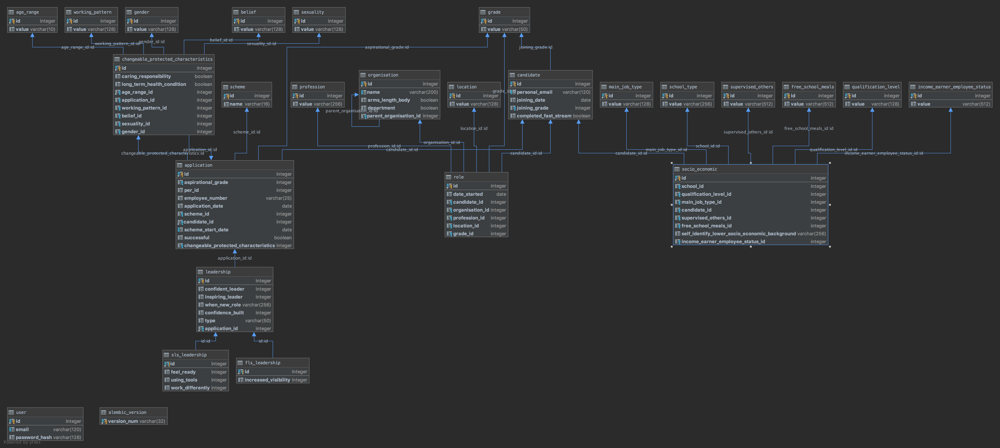

[](https://travis-ci.org/jonodrew/talent-tracker)

# Talent Tracking

This is a simple database-backed web app. It's for tracking data about individuals through a frequent survey. 
This need could probably be met by a commercial customer relationship management system, but this is to prove value rather
than to generate revenue or be a long-term solution.

The diagram below shows the current database structure.



## Application structure
This is a monolithic app. This use case is not complex enough to need microservices. Future feature requests might 
necessitate it but for now monolith all the way. It's designed as a prototype tool to see if data analysis can be more 
effectively carried out via a database rather than a spreadsheet.

Implementing a web-based interface significantly limits the reports that can be run. Each one has to be coded by hand, 
adding significant extra friction. However, for this prototype, teaching the team using this tool SQL would be poor #
value for money. 

It uses
- sqlalchemy for the Models
- Flask for the webserver
- the GOVUK Design System for the frontend, although it uses pre-compiled assets rather than the npm method

## TODO:

- add an AuditEvent class
- start adding routes with tests
- implement an `authentication` blueprint with tests


## Contribution guidelines
Please contribute to this repo! Any contributions need to be well-tested and pass all the existing tests. To run the 
tests run `make test`: it'll run flake8, which is a linter, to check your syntax is correct. Then it'll run the suite 
of tests already written

Don't forget to pull this repo frequently - it's a live project and things are changing all the time. As a result, 
short-lived branches are appreciated :-)

## Getting started
To run this system you should have installed Docker:
- `git clone`
- `cd talent-tracker`
- `make dev`
- watch in amazement as your system downloads the latest working version of this software, as well as the database 
you'll need to make it work
- after a while your terminal will print:

```
Creating talent-tracker_db_1 ... done
Creating talent-tracker_web_1          ... done
Creating talent-tracker_python-tests_1 ... done
```
- and you'll be able to type `localhost:5000` into your browser.
- at this point you'll want to create your database and seed it with lovely data
- execute the following command: `flask seed --new-install True`
- you should now be able to log into the user interface on `localhost:5000` with the email 
`developer@talent-tracker.gov.uk` and the password `talent-tracker` 
- These credentials will only work locally!
- Now check out `/update` to mess with the candidate whose email address is `staging.candidate@gov.uk`
- Also check out `/reports` to see all the reports in action, complete with your seeded data!
- to stop the system running, run `make stop` in your terminal
